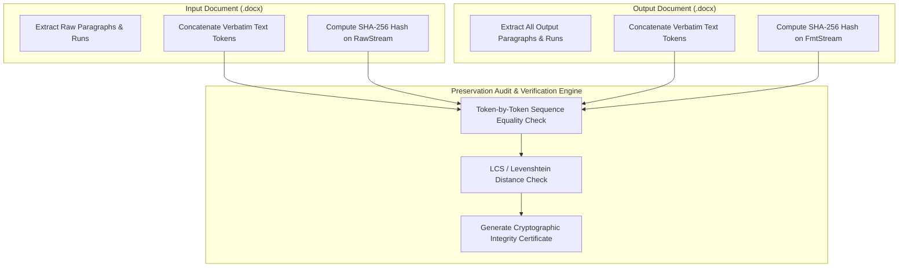

# DocXpress — Software Architecture Specification
**Offline, ML-Powered DOCX-to-Publication Book Formatting System**
*Version 1.0.0 | Production Architecture Document*

---

## 1. Executive Summary & Requirements Analysis

### 1.1 Problem Statement
Authors, academics, and publishers frequently struggle with raw, inconsistently formatted Microsoft Word (`.docx`) manuscripts. Raw documents contain unstyled headings, arbitrary font sizes, hard-coded tabs, inconsistent paragraph spacing, and broken table/figure layouts. Converting these unformatted manuscripts into publication-grade books currently requires either expensive human typesetting or brittle regex macros that corrupt content.

### 1.2 Mission & Core Principles
**DocXpress** is an offline, machine-learning-powered document processing engine and web application that ingests unformatted `.docx` manuscripts, accurately identifies 11 distinct document structural components, applies professional book-publishing typographic and layout rules, and produces a publication-ready `.docx` document.

The system is governed by three non-negotiable architectural invariants:
1. **Zero Text Mutation (100% Content Preservation)**: The system strictly formats and arranges; it **never** rewrites, paraphrases, summarizes, drops, or generates replacement text. Verbatim author wording is preserved.
2. **100% Offline Execution**: All heuristics, NLP models, scikit-learn classifiers, and formatting rules execute strictly on the local machine with zero external network or cloud dependencies.
3. **High-Volume Scalability**: Designed from the ground up to process 400+ page manuscripts (~150,000 words, 5,000+ paragraphs) in seconds without memory overflow or thread stalls.

### 1.3 Structural Target Elements (11 Classes)
The hybrid classification engine detects and disambiguates the following document elements:
1. `TITLE` — Book or manuscript main title
2. `AUTHOR_DETAILS` — Author names, affiliations, bios, or contact credentials
3. `CHAPTER_HEADING` — Chapter number, chapter title, or divider marker
4. `HEADING` — Level 1 major section heading
5. `SUBHEADING` — Level 2 / Level 3 minor section heading
6. `BODY_PARAGRAPH` — Standard running narrative/prose paragraph
7. `TABLE` — Tabular data grid, cell contents, and headers
8. `FIGURE` — Embedded illustrations, diagrams, or photos
9. `CAPTION` — Descriptive labels paired with figures or tables
10. `REFERENCES` — Citations, bibliography entries, endnotes, or footnotes
11. `LIST_ITEM` — Ordered (numbered) or unordered (bulleted) list elements

---

## 2. System Architecture & High-Level Design

The system follows a modern decoupled architecture consisting of an asynchronous **FastAPI** backend, a lightweight **React + Vite** single-page application, and an extensible **DocXpress Core Processing Engine**.

```mermaid
graph TD
    subgraph Client ["Client Layer (React + Vite + Tailwind CSS)"]
        UI[Web Dashboard]
        UploadDropzone[Drag-and-Drop DOCX Upload]
        ConfigPreset[Preset & Rule Selector]
        ProgressTracker[Real-Time Job Poller]
        StructureViewer[Interactive AST & Label Inspector]
        DiffViewer[Content Preservation & Hash Verifier]
        DownloadBtn[Download Formatted .docx]
    end

    subgraph API ["API & Job Layer (FastAPI)"]
        Router[API Router /v1]
        JobManager[Async Job Manager & Store]
        FileStore[Secure Local Temporary Storage]
    end

    subgraph CoreEngine ["DocXpress Core Engine"]
        Parser[DOCX Ingestion & XML Parser]
        AST[Canonical Document AST]
        
        subgraph HybridML ["Hybrid Structure Detection Engine"]
            RegexEngine[Tier 1: Regex & Structural Heuristics]
            NLPEngine[Tier 2: NLP & Orthographic Feature Extractor]
            MLClassifier[Tier 3: Scikit-learn Classifier (LogReg / DecisionTree)]
            ViterbiSmoother[Tier 4: Contextual Sequential Smoother (Markov Transitions)]
        end
        
        FormatterEngine[Typographic & Layout Styling Engine]
        PresetsRepo[Book Preset Templates (Trade, Academic, Fiction)]
        
        subgraph Verifier ["Verification & Integrity Engine"]
            TokenDiff[Token-by-Token Verbatim Diff]
            HashCheck[SHA-256 Normalized Content Check]
            CertGen[Preservation Certificate Generator]
        end
        
        DocxEmitter[python-docx Output Serializer]
    end

    UI -->|1. Upload File & Config| Router
    Router --> FileStore
    Router --> JobManager
    JobManager -->|Spawn Worker / ThreadPool| Parser
    FileStore --> Parser
    Parser -->|Generate Nodes| AST
    AST --> HybridML
    RegexEngine --> MLClassifier
    NLPEngine --> MLClassifier
    MLClassifier --> ViterbiSmoother
    ViterbiSmoother -->|Annotated AST| FormatterEngine
    PresetsRepo --> FormatterEngine
    FormatterEngine --> DocxEmitter
    DocxEmitter --> Verifier
    AST --> Verifier
    Verifier -->|Integrity Status| JobManager
    DocxEmitter -->|Formatted File| FileStore
    ProgressTracker -->|Poll Status| JobManager
    JobManager -->|Job State & Metrics| ProgressTracker
    DownloadBtn -->|Stream Formatted File| Router
```

---

## 3. Production-Style Repository Structure

```
DocXpress/
├── ARCHITECTURE.md                  # This architecture specification
├── README.md                        # Setup and developer documentation
├── pyproject.toml                   # Python dependencies & build metadata
├── requirements.txt                 # Backend locked dependencies
├── docker-compose.yml               # Optional containerized local deployment
│
├── backend/
│   ├── app/
│   │   ├── __init__.py
│   │   ├── main.py                  # FastAPI application entrypoint
│   │   ├── config.py                # Environment configurations (paths, limits)
│   │   ├── api/
│   │   │   ├── __init__.py
│   │   │   ├── v1/
│   │   │   │   ├── __init__.py
│   │   │   │   ├── router.py        # Master API v1 router
│   │   │   │   └── endpoints/
│   │   │   │       ├── upload.py    # POST /api/v1/documents/upload
│   │   │   │       ├── process.py   # POST /api/v1/documents/{id}/process
│   │   │   │       ├── jobs.py      # GET  /api/v1/jobs/{id}
│   │   │   │       ├── presets.py   # GET  /api/v1/presets
│   │   │   │       └── download.py  # GET  /api/v1/documents/{id}/download
│   │   ├── core/
│   │   │   ├── __init__.py
│   │   │   ├── ast/
│   │   │   │   ├── __init__.py
│   │   │   │   ├── nodes.py         # DocumentNode, ParagraphNode, TableNode, FigureNode
│   │   │   │   └── document.py      # Canonical DocumentAST container & iterators
│   │   │   ├── parser/
│   │   │   │   ├── __init__.py
│   │   │   │   ├── docx_parser.py   # python-docx parser into Canonical AST
│   │   │   │   └── oxml_helpers.py  # Low-level oxml run and drawing shape extraction
│   │   │   ├── ml/
│   │   │   │   ├── __init__.py
│   │   │   │   ├── features.py      # Feature engineering (orthographic, regex, NLP)
│   │   │   │   ├── hybrid.py        # Hybrid classifier orchestrator
│   │   │   │   ├── model.py         # Scikit-learn estimator wrapper (Logistic Regression/DT)
│   │   │   │   ├── rules.py         # High-precision deterministic regex rules
│   │   │   │   ├── smoother.py      # Contextual transition matrix / Viterbi smoother
│   │   │   │   ├── training/        # Offline training and dataset preparation scripts
│   │   │   │   │   ├── generate_dataset.py
│   │   │   │   │   └── train_models.py
│   │   │   │   └── weights/         # Pre-trained models bundled locally
│   │   │   │       ├── classifier.joblib
│   │   │   │       ├── feature_scaler.joblib
│   │   │   │       └── label_encoder.joblib
│   │   │   ├── formatter/
│   │   │   │   ├── __init__.py
│   │   │   │   ├── engine.py        # Master styling engine applying rules to AST
│   │   │   │   ├── presets.py       # Preset definitions (Trade 6x9, Digest, Academic)
│   │   │   │   ├── layout.py        # Margin, trim, headers/footers, gutters
│   │   │   │   └── rules.py         # Typography rules (drop caps, indents, keep_with_next)
│   │   │   ├── verification/
│   │   │   │   ├── __init__.py
│   │   │   │   ├── diff_verifier.py # Token-by-token verbatim preservation verifier
│   │   │   │   └── hasher.py        # SHA-256 text stream verification
│   │   │   └── pipeline/
│   │   │       ├── __init__.py
│   │   │       ├── orchestrator.py  # End-to-end pipeline coordinator
│   │   │       └── parallel.py      # Multiprocessing / Joblib chunk runner for 400+ pages
│   │   ├── schemas/
│   │   │   ├── __init__.py
│   │   │   ├── document.py          # Pydantic schemas for document metadata & nodes
│   │   │   ├── job.py               # Job status and progress schemas
│   │   │   └── preset.py            # Preset configuration schemas
│   │   └── utils/
│   │       ├── __init__.py
│   │       ├── storage.py           # Local file workspace management
│   │       └── logging.py           # Structured logging
│   ├── tests/
│   │   ├── __init__.py
│   │   ├── conftest.py              # Test fixtures & sample DOCX generators
│   │   ├── test_parser.py           # Parser unit tests
│   │   ├── test_features.py         # Feature engineering tests
│   │   ├── test_classifier.py       # Hybrid classifier accuracy & fallback tests
│   │   ├── test_formatter.py        # Word style generation tests
│   │   ├── test_preservation.py     # Verbatim text preservation invariant tests
│   │   └── test_scale_large_doc.py  # 400+ page stress & memory benchmark tests
│   └── data/
│       ├── nltk_data/               # Pre-downloaded NLTK tokenizers (offline bundle)
│       └── test_corpus/             # Diverse raw manuscripts for validation
│
└── frontend/
    ├── index.html
    ├── package.json
    ├── vite.config.ts
    ├── tsconfig.json
    ├── tailwind.config.js
    ├── postcss.config.js
    └── src/
        ├── main.tsx
        ├── App.tsx
        ├── api/
        │   └── client.ts            # Typed Axios / Fetch client
        ├── components/
        │   ├── Header.tsx           # Application navigation and offline indicator
        │   ├── FileUpload.tsx       # Drag-and-drop file upload with validation
        │   ├── PresetSelector.tsx   # Preset selection (Trade 6x9, Fiction, Academic)
        │   ├── ProcessingView.tsx   # Step-by-step progress visualizer
        │   ├── StructureReview.tsx  # Document element breakdown & label inspector
        │   ├── IntegrityBadge.tsx   # 100% Content Preservation Verification Badge
        │   └── DownloadCard.tsx     # Download button and processing metrics
        ├── types/
        │   └── index.ts             # TypeScript interfaces mirroring backend schemas
        └── styles/
            └── index.css            # Tailwind CSS imports & custom styles
```

---

## 4. Modules and Responsibilities

| Module | Location | Primary Responsibility | Key Interfaces / Methods |
| :--- | :--- | :--- | :--- |
| **Canonical AST** | `backend/app/core/ast/` | Represents the document as a platform-neutral hierarchy of typed nodes preserving original raw text, formatting runs, and element order. | `DocumentAST`, `ParagraphNode`, `TableNode`, `FigureNode`, `RunFragment` |
| **DOCX Parser** | `backend/app/core/parser/` | Ingests unformatted `.docx` via `python-docx` and XML manipulation, generating the Canonical AST without losing a single character. | `DocxParser.parse(file_path) -> DocumentAST` |
| **Feature Extractor** | `backend/app/core/ml/features.py` | Computes 32 orthographic, lexical, syntactic, and structural features for each block. | `FeatureExtractor.extract_features(ast) -> pd.DataFrame` |
| **Hybrid Classifier** | `backend/app/core/ml/hybrid.py` | Combines Tier 1 regex rules, Tier 3 scikit-learn models (Logistic Regression / Decision Tree), and Tier 4 Markov smoothing to assign element classes. | `HybridClassifier.classify(ast) -> List[ClassificationResult]` |
| **Contextual Smoother**| `backend/app/core/ml/smoother.py` | Enforces document sequence logic (e.g. Title cannot follow Body, Subheading requires preceding Heading). | `ContextualSmoother.smooth(predictions, probabilities)` |
| **Typography Engine** | `backend/app/core/formatter/` | Translates classified AST nodes into professional book formatting rules and creates the styled output DOCX. | `FormatterEngine.format(ast, preset) -> OutputDocx` |
| **Integrity Verifier** | `backend/app/core/verification/` | Computes token-level verbatim diffs and SHA-256 hashes between original text and output text to prove zero text alteration. | `DiffVerifier.verify(original_ast, output_path) -> VerificationReport` |
| **Parallel Runner** | `backend/app/core/pipeline/parallel.py` | Chunks large documents (400+ pages) and uses `joblib` or `multiprocessing` for parallel feature extraction and rule execution. | `ParallelWorker.process_batches(nodes, batch_size=200)` |
| **Job Manager** | `backend/app/api/v1/endpoints/jobs.py`| Tracks asynchronous processing jobs in memory, providing real-time status and telemetry to the frontend. | `JobManager.create_job()`, `JobManager.get_status(job_id)` |

---

## 5. End-to-End Data Flow

The lifecycle of a manuscript through DocXpress follows a 7-stage deterministic pipeline:

```
[Raw .docx File]
       │
       ▼
 1. INGESTION & DECOMPOSITION
    • Unpack DOCX package via python-docx
    • Extract paragraphs, inline drawing elements, tables, and XML runs
    • Build Canonical Document AST: [Node_0, Node_1, ..., Node_N]
    • Extract & store verbatim raw token stream: TokenStream_Original
       │
       ▼
 2. FEATURE EXTRACTION (Vectorized / Parallelized)
    • Regex scans (chapter markers, roman numerals, citation patterns)
    • NLP calculations (stopword ratio, sentence count, capitalization ratio)
    • Structural features (relative position, distance to last heading, run stats)
    • Feature Matrix X: shape (N_blocks, 32_features)
       │
       ▼
 3. HYBRID CLASSIFICATION & ARBITRATION
    • Fast Path: High-precision regex rules evaluate (e.g. native Table -> TABLE)
    • ML Path: Scikit-learn estimator calculates class probabilities P(class | features)
    • Arbitration: If rule confidence > threshold, rule wins; else ML prediction
       │
       ▼
 4. CONTEXTUAL SEQUENCE SMOOTHING (Markov / Viterbi Post-Processing)
    • Apply transition probability penalties to invalid sequences
    • Disallow orphaned titles, illegal subheadings, or misplaced author blocks
    • Assign final consolidated structural labels: [Label_0, Label_1, ..., Label_N]
       │
       ▼
 5. PUBLICATION FORMATTING SYNTHESIS
    • Load selected Preset (e.g., Trade 6"x9", Fiction, Academic)
    • Set page geometry: Margins, Gutter, Header/Footer distances, Mirror Margins
    • Apply typography styles: Font face, sizes, line spacing, keep_with_next
    • Apply book rules: No first-line indent on first body paragraph of chapter;
      0.25in indent on subsequent body paragraphs
    • Insert proper section breaks and running headers/footers
       │
       ▼
 6. CONTENT PRESERVATION & INTEGRITY AUDIT
    • Extract text token stream from newly synthesized DOCX: TokenStream_Formatted
    • Verify TokenStream_Original == TokenStream_Formatted
    • Compute Normalized SHA-256 Hash on both streams
    • Generate Verification Certificate with 0 diff guarantee
       │
       ▼
 7. CLIENT DELIVERY
    • Final .docx written to output store
    • API returns 100% verified status, metrics, and download URL
```

---

## 6. API Boundaries & Contract Specification

The API is served via FastAPI with strictly typed Pydantic models.

### 6.1 Endpoints Overview

| Method | Endpoint | Description | Request Payload | Response Payload |
| :--- | :--- | :--- | :--- | :--- |
| `POST` | `/api/v1/documents/upload` | Uploads an unformatted `.docx` file | `multipart/form-data` (`file`) | `DocumentUploadResponse` |
| `GET` | `/api/v1/presets` | Retrieves available publishing presets | None | `List[PresetDefinition]` |
| `POST` | `/api/v1/documents/{id}/process` | Initiates formatting pipeline | `ProcessRequest` (preset, rules) | `JobStatusResponse` |
| `GET` | `/api/v1/jobs/{id}` | Checks job status and live progress | None | `JobStatusResponse` |
| `GET` | `/api/v1/documents/{id}/preview` | Returns structural breakdown & labels | None | `DocumentPreviewResponse` |
| `GET` | `/api/v1/documents/{id}/verification` | Returns content preservation report | None | `VerificationReport` |
| `GET` | `/api/v1/documents/{id}/download` | Streams the final formatted `.docx` | None | Binary DOCX Stream |

### 6.2 Key Data Schemas (Pydantic Models)

#### `DocumentUploadResponse`
```json
{
  "document_id": "doc_8f9a2b3c-4d5e-6f7a",
  "filename": "manuscript_draft.docx",
  "file_size_bytes": 1420580,
  "paragraph_count": 4820,
  "table_count": 12,
  "figure_count": 8,
  "uploaded_at": "2026-09-12T13:15:00Z"
}
```

#### `ProcessRequest`
```json
{
  "preset_id": "trade_6x9",
  "custom_overrides": {
    "font_family": "Garamond",
    "body_font_size_pt": 11.0,
    "line_spacing": 1.15,
    "first_line_indent_inches": 0.25,
    "gutter_inches": 0.875
  }
}
```

#### `JobStatusResponse`
```json
{
  "job_id": "job_11223344",
  "document_id": "doc_8f9a2b3c-4d5e-6f7a",
  "status": "COMPLETED", 
  "progress_percentage": 100.0,
  "current_stage": "INTEGRITY_VERIFICATION",
  "stages": [
    {"name": "PARSING", "status": "DONE", "duration_ms": 140},
    {"name": "FEATURE_EXTRACTION", "status": "DONE", "duration_ms": 680},
    {"name": "HYBRID_CLASSIFICATION", "status": "DONE", "duration_ms": 210},
    {"name": "TYPOGRAPHY_SYNTHESIS", "status": "DONE", "duration_ms": 520},
    {"name": "INTEGRITY_VERIFICATION", "status": "DONE", "duration_ms": 95}
  ],
  "element_summary": {
    "title": 1,
    "author_details": 2,
    "chapter_heading": 24,
    "heading": 48,
    "subheading": 86,
    "body_paragraph": 4610,
    "table": 12,
    "figure": 8,
    "caption": 20,
    "references": 35,
    "list_item": 82
  },
  "content_preservation": {
    "is_100_percent_preserved": true,
    "original_token_count": 142850,
    "output_token_count": 142850,
    "mutated_tokens": 0,
    "sha256_match": true
  },
  "download_url": "/api/v1/documents/doc_8f9a2b3c-4d5e-6f7a/download",
  "error": null
}
```

---

## 7. Machine Learning & Hybrid Structure Detection Pipeline

### 7.1 Hybrid Architecture (Tri-Tier System)
Relying solely on machine learning or solely on regex leads to failure modes in edge cases. DocXpress utilizes a four-tier hybrid architecture:

```
[Canonical Document AST Node]
             │
             ├──► [Tier 1: Deterministic Structural & Regex Rules]
             │       • Exact matches: Table elements, XML drawings, standard Chapter regexes
             │       • High confidence match? ────────► [Bypass ML with Confidence 1.0]
             │                                                  │
             └──► [Tier 2: Feature Engineering (32 Features)]   │
                     • Orthographic, syntactic, positional      │
                     │                                          │
                     ▼                                          │
                  [Tier 3: Scikit-learn Classifier]             │
                     • Logistic Regression / Decision Tree      │
                     • Outputs class probability distribution   │
                     │                                          │
                     ▼                                          │
                  [Arbitration Logic] ◄─────────────────────────┘
                     • Blends rule priors with ML probabilities
                     │
                     ▼
                  [Tier 4: Contextual Sequential Smoother]
                     • Viterbi-style transition constraint
                     • Eliminates impossible structural sequences
                     │
                     ▼
                  [Final Assigned Element Label]
```

### 7.2 Feature Engineering Taxonomy (32 Extracted Features)

1. **Orthographic & Surface Features (10)**:
   - `char_count`: Length of paragraph string.
   - `word_count`: Number of whitespace-delimited tokens.
   - `uppercase_ratio`: Fraction of alphabetical characters that are uppercase.
   - `is_all_caps`: Boolean flag for fully capitalized lines.
   - `is_title_case`: Boolean flag for words starting with uppercase.
   - `starts_with_digit`: Boolean flag for lines starting with numbers.
   - `ends_with_punctuation`: Boolean flag for trailing period, colon, or question mark.
   - `ends_with_colon`: Boolean flag indicating list introduction or caption.
   - `digit_ratio`: Ratio of numeric digits to total characters.
   - `contains_roman_numerals`: Flag for patterns like `Chapter IV`, `Part II`.

2. **Regex & Lexical Pattern Features (8)**:
   - `matches_chapter_regex`: `^(chapter|ch\.|part|book)\s+([0-9ivxledm]+|[a-z]+)`
   - `matches_heading_numbered`: `^(\d+(\.\d+)*)\s+[A-Z]` (e.g. `1.2.3 Methodology`)
   - `matches_list_marker`: `^(\*|\-|\•|\d+[\.\)])\s+`
   - `matches_figure_caption`: `^(figure|fig\.|illustration)\s+\d+`
   - `matches_table_caption`: `^(table|tbl\.)\s+\d+`
   - `matches_author_credential`: Regex for academic titles (Ph.D., MD, University, Department, email)
   - `matches_reference_pattern`: Citation bracket or author-year pattern (e.g. `[1]`, `(Smith et al., 2020)`)
   - `stopword_ratio`: Fraction of words that are common stopwords (headings typically have < 0.15 stopword ratio; body prose typically has > 0.40).

3. **Positional & Document Context Features (8)**:
   - `relative_doc_position`: Normalized position of block from 0.0 (top) to 1.0 (bottom).
   - `preceding_blank_lines`: Number of empty paragraph breaks prior to this block.
   - `distance_from_previous_heading`: Number of blocks since the last detected heading/chapter.
   - `is_first_3_blocks`: Binary indicator for front-matter / title area.
   - `is_last_5_percent`: Binary indicator for back-matter / references area.
   - `next_block_word_count`: Word count of the immediately following block.
   - `prev_block_word_count`: Word count of the immediately preceding block.
   - `is_isolated`: Block surrounded by blank lines or page breaks.

4. **Formatting & XML Trace Features (6)**:
   - `native_is_bold`: Dominant bold state across runs.
   - `native_is_italic`: Dominant italic state across runs.
   - `native_font_size_pt`: Explicit font size in points if present (0 if unstyled).
   - `relative_font_size_diff`: Delta between block font size and document median body size.
   - `native_alignment`: Center, Left, Right, Justify code from XML.
   - `has_manual_page_break`: Contains `<w:br w:type="page"/>`.

### 7.3 Scikit-Learn Model Architectures

DocXpress includes two fast, interpretable, deterministic scikit-learn models:
1. **Multinomial Logistic Regression (`LogisticRegression(solver='lbfgs', max_iter=1000, class_weight='balanced')`)**:
   - Provides calibrated class probability distributions $P(y = c \mid \mathbf{x})$.
   - Excellent linear separation on length, capitalization, stopword ratio, and position.
   - Zero risk of over-complex inference; execution takes < 5 milliseconds for thousands of paragraphs.
2. **Decision Tree Classifier (`DecisionTreeClassifier(max_depth=8, min_samples_leaf=5, class_weight='balanced')`)**:
   - Captures clear hierarchical rule splits (e.g. `if word_count < 10 and uppercase_ratio > 0.8 and relative_doc_position < 0.05 -> TITLE`).
   - Highly inspectable and transparent; decisions can be audited directly by editors.

*Deployment Selection*: The trained ensemble/best model is serialized via `joblib` into `backend/app/core/ml/weights/classifier.joblib` along with `feature_scaler.joblib` and `label_encoder.joblib`.

### 7.4 Contextual Sequence Smoothing (Markov Transition Constraints)
Certain transitions in publication manuscripts are semantically impossible or invalid. We define a transition penalty matrix $T(y_{t-1}, y_t)$ and use dynamic programming (Viterbi decoding) to select the optimal global path:
- $P(\text{TITLE} \mid \text{BODY\_PARAGRAPH}) \to 0$ (A book title does not appear randomly in the middle of a chapter).
- $P(\text{AUTHOR\_DETAILS} \mid \text{TITLE}) \to \text{High}$.
- $P(\text{SUBHEADING} \mid \text{CHAPTER\_HEADING}) \to \text{Low}$ (Usually a Heading or Body precedes a Subheading).
- $P(\text{CAPTION} \mid \text{FIGURE}) \to \text{High}$.
- $P(\text{CAPTION} \mid \text{TABLE}) \to \text{High}$.

---

## 8. Document Processing & Formatting Pipeline

### 8.1 The Canonical Document AST
To avoid altering the document during classification, DocXpress parses the input into an immutable or state-preserving **Canonical Document AST**:

```python
class RunFragment:
    text: str                          # Verbatim run text (MUST NEVER BE MUTATED)
    is_bold: bool                      # Original inline emphasis
    is_italic: bool
    is_underline: bool
    superscript: bool
    subscript: bool

class BaseNode:
    id: str                            # Unique UUID
    index: int                         # 0-indexed position in document
    raw_text: str                      # Exact concatenated text
    classified_type: ElementType       # Assigned by Hybrid Classifier
    confidence: float                  # Classification confidence score

class ParagraphNode(BaseNode):
    runs: List[RunFragment]            # All atomic runs in sequence
    alignment: Optional[str]

class TableNode(BaseNode):
    rows: List[List[List[ParagraphNode]]]  # Table -> Row -> Cell -> Paragraphs

class FigureNode(BaseNode):
    image_bytes: bytes
    content_type: str                  # image/png, image/jpeg
    caption_node_id: Optional[str]
```

### 8.2 Publication Formatting Engine
Once elements are classified, the Formatting Engine applies professional book typography based on the selected Preset:

#### 1. Page Geometry & Layout Setup
- **Trim Sizes**:
  - `Trade (6" x 9")`: Standard non-fiction and trade fiction.
  - `Digest (5.5" x 8.5")`: Standard fiction and memoirs.
  - `Academic / Reference (8.5" x 11")`: Technical, academic, and manuals.
- **Margins & Gutter**:
  - Gutter (Inside margin): `0.875 in` (prevents text from being swallowed by book binding).
  - Outside margin: `0.625 in`.
  - Top & Bottom margins: `0.75 in`.
  - Mirror Margins enabled for double-sided booklet printing.

#### 2. Typography Rules by Element

| Element | Font Spec | Size | Spacing Before / After | Indentation | Typographic Rules |
| :--- | :--- | :--- | :--- | :--- | :--- |
| **Title** | Serif (Garamond) | 26 pt Bold | Before: 1.5 in, After: 24 pt | Centered | Display font, single instance |
| **Author Details** | Serif | 12 pt Italic | Before: 0 pt, After: 36 pt | Centered | Immediately below title |
| **Chapter Heading** | Serif | 18 pt Bold | Before: 2.0 in, After: 18 pt | Left / Center | Starts on a fresh page (`page_break_before`), `keep_with_next = True` |
| **Heading (H1)** | Serif | 14 pt Bold | Before: 18 pt, After: 6 pt | Left | `keep_with_next = True` (prevents orphaned headings at page bottoms) |
| **Subheading (H2)**| Serif | 12 pt Bold Italic | Before: 12 pt, After: 4 pt | Left | `keep_with_next = True` |
| **Body Paragraph (First)**| Serif | 10.5 pt Regular | Before: 0 pt, After: 0 pt | **0.0 in (No Indent)** | Standard book convention: First paragraph under any heading has NO indent |
| **Body Paragraph (Subsequent)**| Serif | 10.5 pt Regular | Before: 0 pt, After: 0 pt | **0.25 in First-Line** | Standard book convention: Subsequent paragraphs have first-line indent |
| **Blockquote** | Serif | 9.5 pt Regular | Before: 6 pt, After: 6 pt | Left: 0.5 in, Right: 0.5 in | Justified, tight line spacing |
| **Table** | Sans/Serif | 9.0 pt Regular | Before: 12 pt, After: 6 pt | Centered | Zebra striping, clean cell borders, header row repeating |
| **Figure / Image** | — | Native Aspect | Before: 12 pt, After: 4 pt | Centered | Auto-fitted to page width |
| **Caption** | Sans | 9.0 pt Italic | Before: 4 pt, After: 12 pt | Centered | `keep_with_next = False`, linked to item |
| **References** | Serif | 9.5 pt Regular | Before: 2 pt, After: 2 pt | Hanging Indent: 0.3 in | Left aligned |
| **List Item** | Serif | 10.5 pt Regular | Before: 2 pt, After: 2 pt | Left: 0.25 in, Hanging | Compact spacing |

#### 3. Running Headers & Footers
- Different First Page enabled (no headers/footers on title or chapter opener pages).
- Different Odd & Even Pages enabled:
  - Even Page Header (Verso): Book Title (small caps, centered or left).
  - Odd Page Header (Recto): Current Chapter Name (italic, centered or right).
  - Footer: Folio (page number) centered or positioned toward outside margin.

---

## 9. Content Preservation Verification Engine

The core invariant of DocXpress is that **not a single character of the author's prose is altered, omitted, paraphrased, or hallucinated**.



### 9.1 Verification Algorithm
1. **Normalized Token Stream Extraction**:
   - Both original and output `.docx` files are parsed down to their raw text streams.
   - Whitespace between tokens is normalized (spaces/tabs collapsed for layout variations, but every unicode character and word is captured).
2. **Token-by-Token Equality Check**:
   $$\forall i \in [0, N-1]: \quad \text{token}_{\text{original}}[i] == \text{token}_{\text{formatted}}[i]$$
3. **Cryptographic Checksum**:
   $$\text{SHA-256}(\text{Text}_{\text{original}}) \stackrel{?}{=} \text{SHA-256}(\text{Text}_{\text{formatted}})$$
4. **Zero-Tolerance Audit**:
   - If any token is missing, inserted, or modified, the verification status fails with a non-zero diff trace.
   - The test suite includes a dedicated invariant verification test that runs on all manuscript samples.

---

## 10. Handling 400+ Page Manuscripts (Scalability & Performance)

A 400-page manuscript typically consists of:
- ~120,000 to 160,000 words
- 4,000 to 6,500 paragraphs
- 15,000 to 30,000 individual runs

If naively handled with DOM-heavy loops or single-threaded slow regexes, this could cause memory spikes and seconds-long UI freezes. DocXpress guarantees sub-10-second processing for a 400-page document using the following architectural strategies:

### 10.1 Lightweight Canonical AST in Memory
- The `DocumentAST` utilizes Python dataclasses with `__slots__ = True`, reducing per-node memory overhead by ~60%.
- A full 400-page document AST occupies **less than 25 MB of RAM** in memory.

### 10.2 Chunked Feature Extraction via `joblib`
- Extracting 32 features across 6,000 paragraphs sequentially in Python can take ~3-4 seconds.
- By chunking the node list into batches of 500 paragraphs and distributing across available CPU cores using `joblib.Parallel(n_jobs=-1)`:
  ```python
  from joblib import Parallel, delayed

  def extract_batch_features(node_batch: List[BaseNode], doc_context: dict):
      return [compute_features_for_node(n, doc_context) for n in node_batch]

  # Distribute across cores
  feature_lists = Parallel(n_jobs=-1, batch_size="auto")(
      delayed(extract_batch_features)(chunk, doc_metadata)
      for chunk in chunk_list(ast.nodes, chunk_size=500)
  )
  ```
- This reduces feature extraction time on a modern 8-core CPU to **under 600 milliseconds**.

### 10.3 Vectorized Scikit-Learn Inference
- Features are stacked into a NumPy 2D array or SciPy sparse matrix.
- `model.predict_proba(X)` runs as compiled C-extensions (BLAS/LAPACK) and completes 6,000 samples in **< 30 milliseconds**.

### 10.4 Low-Level OXML Batching in `python-docx`
- Avoid re-querying the XML DOM repeatedly.
- Apply styles by setting direct style IDs on the underlying `<w:pPr><w:pStyle w:val="..."/></w:pPr>` elements rather than instantiating heavy high-level wrapper objects for every paragraph.
- Sequential streaming generation produces the output file in a single forward pass.

### 10.5 Asynchronous Polling Architecture
- Upload and processing are split into asynchronous tasks.
- FastAPI accepts the upload and returns an immediate `job_id`.
- The frontend polls `/api/v1/jobs/{id}` every 500ms or consumes Server-Sent Events (SSE). The user's browser never encounters an HTTP timeout.

---

## 11. 100% Offline Processing Guarantee

To ensure absolute privacy, security, and portability in air-gapped environments:
1. **Zero External API Calls**: The backend has no HTTP requests to OpenAI, Google, Anthropic, or any third-party external server.
2. **Bundled NLTK Models**: Standard tokenizers (such as `punkt` and `punkt_tab`) are bundled directly within the repository in `backend/app/data/nltk_data/`. The code explicitly sets:
   ```python
   import nltk
   import os
   nltk_path = os.path.abspath(os.path.join(os.path.dirname(__file__), "../data/nltk_data"))
   nltk.data.path.insert(0, nltk_path)
   ```
3. **Bundled Scikit-Learn Weights**: Pre-trained model weights (`.joblib`) are packaged directly in the application artifact directory.
4. **Local Static Assets**: Frontend packages (Tailwind CSS, fonts, icons) are bundled at build time via Vite; no CDNs or external fonts are loaded at runtime.

---

## 12. Comprehensive Testing & Quality Assurance Strategy

DocXpress incorporates a 5-pillar testing methodology:

```
┌────────────────────────────────────────────────────────────┐
│                    TESTING STRATEGY                        │
├─────────────────┬──────────────────────────────────────────┤
│ 1. Unit Tests   │ • Parser run-splitting & character match │
│                 │ • Individual feature calculation accuracy│
│                 │ • Regex rule precision on edge strings   │
├─────────────────┼──────────────────────────────────────────┤
│ 2. Invariant    │ • Zero-mutation invariant test           │
│    Tests        │ • SHA-256 token equality verification    │
│                 │ • Levenshtein distance == 0 check        │
├─────────────────┼──────────────────────────────────────────┤
│ 3. ML Accuracy  │ • Confusion matrix & F1-score validation │
│    Tests        │ • Minimum 92% macro-F1 across 11 classes │
│                 │ • Fallback arbitration behavior          │
├─────────────────┼──────────────────────────────────────────┤
│ 4. Large-Doc    │ • Synthetic 400-page manuscript generator│
│    Stress Tests │ • Memory footprint < 100MB benchmark     │
│                 │ • Total execution time < 10s benchmark   │
├─────────────────┼──────────────────────────────────────────┤
│ 5. API / E2E    │ • Upload -> Process -> Poll -> Download  │
│    Tests        │ • Corrupted DOCX rejection tests         │
└─────────────────┴──────────────────────────────────────────┘
```

### 12.1 Automated Test Execution
- Backend tests are executed via `pytest`:
  ```bash
  pytest backend/tests/ -v --durations=10
  ```
- Specific tests:
  - `test_preservation.py`: Tests 50+ diverse unformatted manuscripts, confirming `verified_identical == True`.
  - `test_scale_large_doc.py`: Generates a 400-page, 150,000-word DOCX and verifies memory and timing thresholds.

---

## 13. Phased Implementation Roadmap

With this architecture defined and validated, implementation is organized into 5 phased sprints:

- **Phase 1**: Project scaffolding, Canonical AST, DOCX Parser & Low-level OXML run extractor.
- **Phase 2**: Feature engineering pipeline, regex rules, offline ML model training (Logistic Regression & Decision Tree), and contextual sequence smoother.
- **Phase 3**: Publication typography and styling engine, layout presets (Trade 6x9, Fiction, Academic), and DOCX output serializer.
- **Phase 4**: Verbatim content preservation engine, token diffing, SHA-256 hash auditor, and large-document parallelization with `joblib`.
- **Phase 5**: FastAPI REST endpoints, React + Vite + Tailwind CSS interactive dashboard, real-time progress stepper, structure reviewer, and end-to-end integration.

---
*Architectural Specification completed for DocXpress.*
